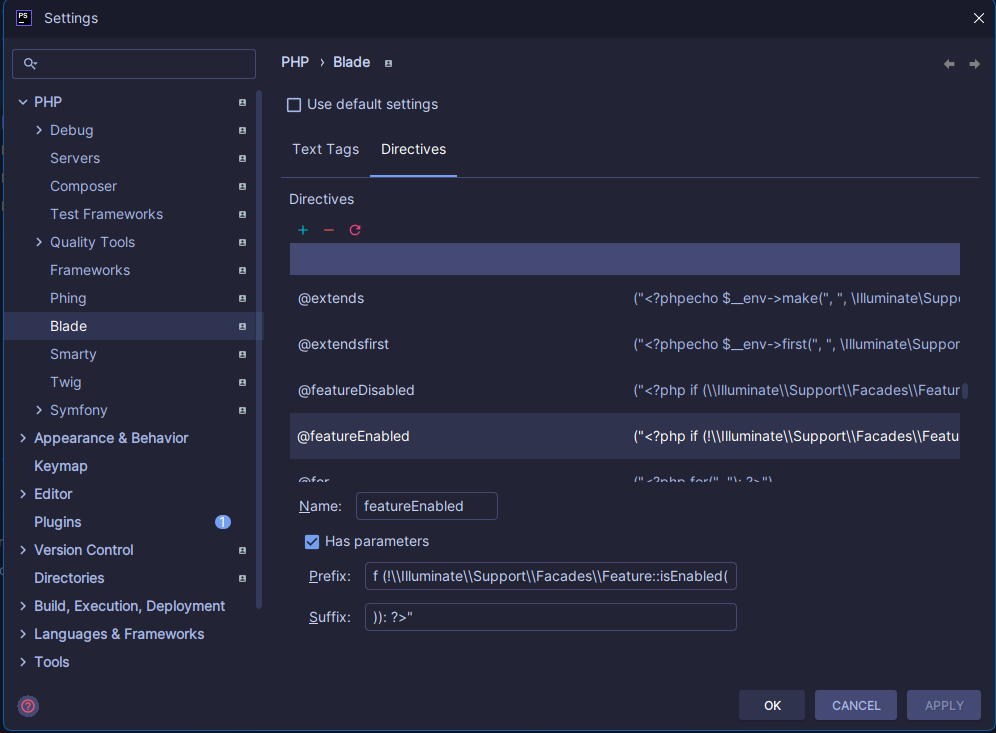

# Laravel Unleash

A simple Unleash component for Laravel. It is compatible with the [Unlesah-hosted.com SaaS offering](https://www.getunleash.io/), [Unleash Open-Source](https://github.com/Unleash/unleash), and [GitLab's Feature Flag system](https://docs.gitlab.com/ee/operations/feature_flags.html), which is built on Unleash.

V2 of this package is a wrapper and extension of the [Unleash PHP SDK](https://docs.getunleash.io/sdks/php_sdk) that is compatible with Laravel.

## Getting started

### 1. Install the Laravel Unleash via Composer
```bash
composer require j-webb/laravel-unleash
```

### 2. Configure

#### Create local configuration (optional)
```bash
php artisan vendor:publish --provider="JWebb\Unleash\Providers\ServiceProvider"
```

#### Run migartions
```bash
php artisan migrate
```

#### Required .env values

```dotenv
# UNLEASH
UNLEASH_URL='[API_URL]' #https://featureflag-dev.kjsoftware.nl/api
UNLEASH_PROJECT_NAME='[NAME_OF_APP_IN_UNLEASH]' #Name of the project in Unleash
```

#### Optional .env values
```dotenv
# Enable or disable the Laravel Unleash client. If disabled, all feature checks will return false
UNLEASH_ENABLED=true

# Enable or disable fetching of features from the Unleash server, can fallback on Bootstrap method (see config/features.php)
UNLEASH_FETCHING_ENABLED=true

# For compatibility with Unleash V4, or other authentcation methods. Appends itself to the `Authorization` header for each request
UNLEASH_API_KEY=123456

# Instance id for this application (typically hostname, podId or similar)
UNLEASH_INSTANCE_ID=default

# The Unleash environment name, which can be used to as a parameter for enabling/disabling features for local or development environments
# See: https://docs.getunleash.io/advanced/strategy_constraints#constrain-on-a-specific-environment
UNLEASH_ENVIRONMENT=production

# Automatically registers the client instance with the unleash server
UNLEASH_AUTOMATIC_REGISTRATION=true

# Enable/Disable metrics
UNLEASH_METRICS=true

# Enable/Disable failsafe cache for data
# See: https://docs.getunleash.io/client-specification#system-overview
UNLEASH_CACHE_ENABLED=true
UNLEASH_CACHE_TTL=30

```
#### App config
Add resolver and repository to the `config/unleash.php` file
```php
return [
    'context_provider' => \App\Providers\FeatureFlagContextProvider::class, // Provider from project

    'context_items' =>[
        [
            'repository' => \App\Repositories\UserRepository::class,
            'resolver' => \App\Resolver\UserResolver::class,
            'property' => 'userId' //Name of property used in Unleash strategy
        ],
        [
            'repository' => \App\Repositories\RelationRepository::class,
            'resolver' => \App\Resolver\RelationResolver::class,
            'property' => 'relationId' //Name of property used in Unleash strategy,
        ],

    ],
]
````


Make sure that the models that you use and want to resolve, implement the interface and function:
```php
use JWebb\Unleash\Contracts\Feature\FeatureModelContract;

class Contact extends Model implements FeatureModelContract
{
    public function getStringIdentifier(): ?string
    {
        return $this->VolledigeNaam;
    }
}
```

#### Register the routes
In order to add the routes to your application, you can add the following line to your project `routes/web.php` file:
```php
\JWebb\Unleash\Facades\Unleash::routes();
```

This adds the following routes to your application:
- feature-flags/refresh


#### Setting up the Middleware

See [Middleware](/docs/middleware.md)

#### Setting up a custom cache handler
If the cache option is enabled, by default the component will use the Laravel Cache module. By utilizing the `UnleashCacheHandlerInterface`, you can create your own PSR-16 compatible implementation and override the `unleash.cache.handler` config value with your handler class.

#### Setting up custom strategies
To add your own strategy, you can override or create your own Strategies Provider. A `UnleashStrategiesProviderInterface` is included for convenience. Once your custom class is build, you should modify the `unleash.strategy_provider` config value.

#### Overwriting default context provider
If you want to send more context by default, you can overwrite the `UnleashContextProvider`. Make sure that your class implements the `Unleash\Client\ContextProvider\UnleashContextProvider` interface (to prevent confusion with the UnleashContextProvider in this package, an option would be to alias it). After that, change the config value of `unleash.context_provider` to your custom created class.

## Usage

Checking individual features
```php
use JWebb\Unleash\Facades\Unleash;

if (Unleash::isEnabled('your_feature')) {
    // Your feature is enabled
}
```

Using array of features.
```php
// List of all features, enabled or disabled
use JWebb\Unleash\Facades\Unleash;

$allFeatures = Unleash::getFeatures();
Result: [
    'toggles' => [
        'feature_1' => [
            'enabled' => true,
            'name' => 'feature_1'
        ],
        'feature_2' => [
            'enabled' => false,
            'name' => 'feature_2'
        ]
    ]
]

// List of all enabled features
$enabledFeatures = Unleash::getFeatures(true);
Result: [
    'toggles' => [
        'feature_1' => [
            'enabled' => true,
            'name' => 'feature_1'
        ]
    ]
]
```
*Note: The result matches that which would be returned from the official [Unleash Proxy](https://docs.getunleash.io/sdks/unleash-proxy) instances. This means you could use your Laravel application as an Unleash Proxy endpoint, which is compatible with the official client-side Unleash Proxy SDKs*

Using middleware on a controller
``` php
class ExampleController extends Controller
{
    public function __construct()
    {
        ...
        $this->middleware('feature:your_feature');
    }
}
```

Using middleware on a route
``` php
Route::get('/', function () {
    //
})->middleware('feature:your_feature');
```

Because the component is a wrapper of the official [Unleash Client SDK](https://github.com/Unleash/unleash-client-php), you can pass relevant context to your checks:
``` php
$context = (new UnleashContext())
    ->setCurrentUserId('some-user-id-from-app')
    ->setIpAddress('127.0.0.1')
    ->setSessionId('sess-123456');
$enabled = Unleash::isEnabled('some-feature', $context);
```
*Note: User ID information is automatically added to the context using the [Laravel Auth module](https://laravel.com/docs/8.x/authentication)*

Or get variant information
``` php
$variant = $unleash->getVariant('nonexistentFeature');
assert($variant->isEnabled() === false);
```

### Blade

You can use the Unleash Blade directive for checking if a feature is enabled in your Blade templates:

```blade
@featureEnabled('betaTester')
    <p>You are a beta tester</p>
@endfeatureEnabled
```

Or if a feature is **disabled**:

```blade
@featureDisabled('betaTester')
    <p>Enroll now to be a beta tester.</p>
@endfeatureDisabled
```

#### PHP storm settings
Add following settings to phpstorm
* Go to `PHP` -> `Blade` -> `Directives`
* Add `@featureEnabled` and `@featureDisabled` to the list of custom directives

##### `@featureEnabled`
* Name: `featureEnabled`
* Prefix: `<?php if (\\Illuminate\\Support\\Facades\\Feature::isEnabled("`
* Suffix: `)): ?>"`

##### `@endfeatureEnabled`
* Name: `endfeatureEnabled`

### `@featureDisabled`
* Name: `featureDisabled`
* Prefix: `<?php if (!\\Illuminate\\Support\\Facades\\Feature::isEnabled("`
* Suffix: `)): ?>"`

### `@endfeatureDisabled`
* Name: `endfeatureDisabled`

_Example_


### Database
See [Database](/docs/database.md)